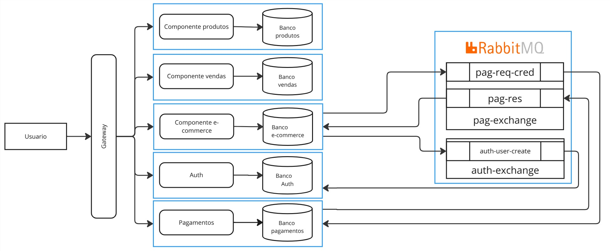

# sistema_vendas

## Arquitetura:


## Funcionalidades:

|      Componente       | Funcionalidades                                                                                                                                                                        |
|:---------------------:|----------------------------------------------------------------------------------------------------------------------------------------------------------------------------------------|
|  Componente-produtos  | [x] Listar produtos <br> [x] Adicionar produtos <br> [x] Atualizar produtos                                                                                                            |
|   Componente-vendas   | [x] Listar vendas <br> [x] Criar vendas <br> [x] Criar funcionarios <br> [x] Editar funcionarios <br> [x] Remover funcionarios                                                         |
| Componente-ecommerce  | [x] Criar usuarios <br> [x] Editar usuarios <br> [x] Remover usuarios <br> [x] Listar usuarios <br> [x] Criar vendas <br> [x] Atualizar status da venda <br> [ ] Permissão de usuarios |
| Componente-pagamentos | [x] Criar pagamentos <br> [x] Consultar pagamentos                                                                                                                                     |
|  Componente-gateway   | [x] Roteamento de requisições                                                                                                                                                          |
|    Componente-auth    | [ ] Autenticação de usuários                                                                                                                                                           |

## Executar projeto:

### 1. Clonar repositório e submódulos:
```bash
git clone https://github.com/EnityBlackHawk/sistema_vendas.git
git submodule update --init --recursive
```

### 2. Buildar projeto:
```bash
sudo docker compose build
```

### 3. Executar projeto:
#### 3.1. Sem expor portas:
```bash
sudo docker compose up -d
```
#### 3.2. Expondo portas:
```bash
sudo docker compose -f docker-compose.dev.yaml up [...services] -d
```